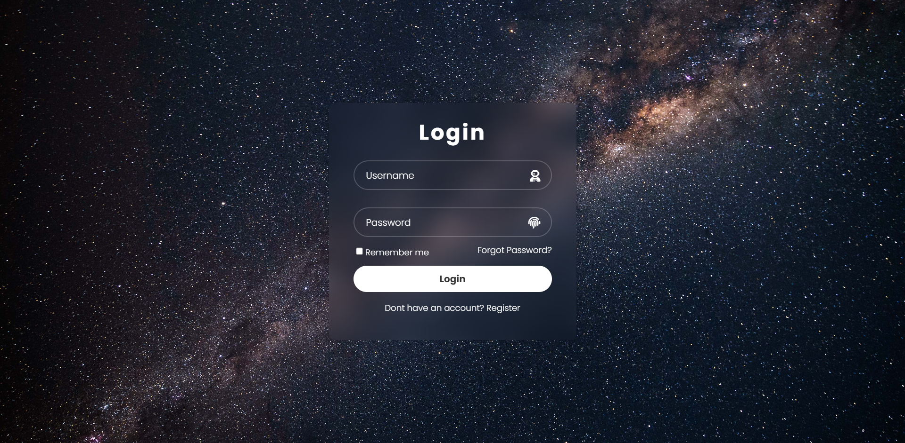

This project was created with Html and CSS for the login form

## Table of contents

- [Overview](#overview)
  - [The challenge](#the-challenge)
  - [Screenshot](#screenshot)
  - [Links](#links)
- [My process](#my-process)
  - [Built with](#built-with)
- [Author](#author)

## Overview

### Screenshot

### Links

- [Solution URL]()

## My process

### Built with

- Semantic HTML5 markup
- CSS custom properties
- Pure CSS

- This project -  [
 Codehal] (https://www.youtube.com/@codehal) Inspired by the youtube channel

## Author

- Frontend Mentor - [@Voldemort-07](https://www.frontendmentor.io/profile/Voldemort-07)
- Linkedin - (https://www.linkedin.com/in/yunus-emre-%C3%B6zt%C3%BCrk-83a794250/)

